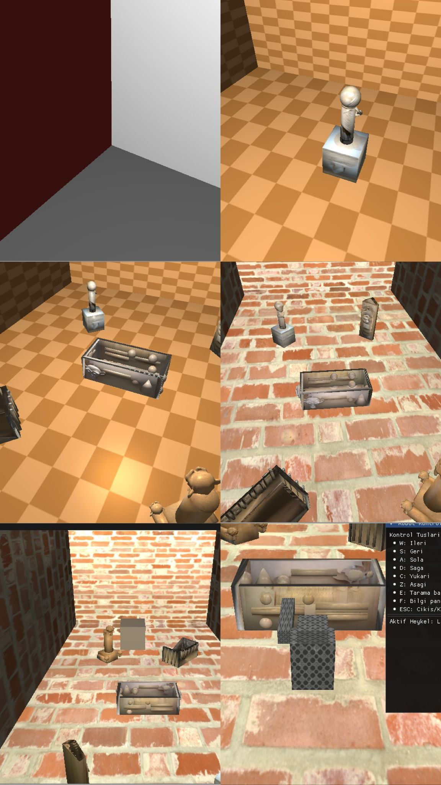
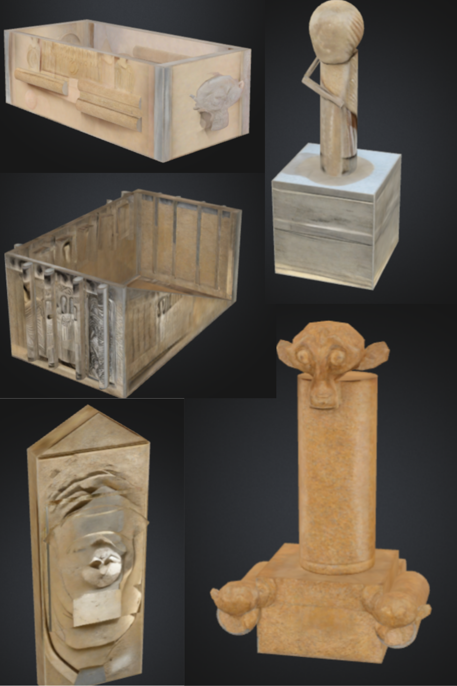

 📷 Screenshots

---

🎥 Demo Videos

▶️ [Click to Watch Project Demo Video (Google Drive)](https://drive.google.com/file/d/1qXKKGagXrI1DGNOJiRkAXx7NYNr-_VTq/view?usp=drive_link)

🎨 [Click to Watch Blender Presentation (Google Drive)](https://drive.google.com/file/d/1H_938VqS7uC_fDMTRRo203Twf52HDf5K/view?usp=drive_link)

-------------------------------------
Virtual Museum Project
-----------------------------------

This project aims to create a 3D virtual museum environment using OpenGL. Users can navigate within the museum, examine statues, and receive information about the statues via a robot guide.

✨ Project Features
3D virtual museum environment
Controllable robot guide
Statue collection and information system
Camera that follows the robot
Info panels about statues
Statue scanning system via robot
Realistic lighting effects
User interface with ImGui

🛠️ Technologies Used
Main Libraries:
OpenGL: for 3D graphics processing
GLAD: for loading OpenGL functions
GLFW: for window creation and input management
GLM: for 3D math operations
ImGui: for user interface
Assimp: for loading 3D model files
stb_image: for loading image files

📁 Project Structure
Virtual Museum/
include/   Header files
src/       Source codes
external/  External libraries
imgui/     ImGui library
textures/ Texture files
models/    3D model files
build/     Build outputs
docs/      Screenshots and videos   

🏗️ Main Classes

Camera Class: Manages camera position and direction. Includes system to follow the robot. Contains functions like getViewMatrix(), getProjectionMatrix().

Robot Class: Manages robot model and its movements. Includes movement functions like moveForward(), turnLeft(). 

RobotMesh Class: Manages the 3D model (mesh) of the robot, including its body and arm. It is responsible for loading the robot's texture, defining its geometry (vertices and indices), and setting up OpenGL buffers for rendering.

StatueManager Class: Manages statues. Performs proximity checks and starts scanning. Contains functions like updateStatueProximity(), startScanning().

Renderer Class: Renders the entire scene. Renders statues, robot, and the room. Also manages shaders.

UIManager Class: Manages UI with ImGui. Displays information panels and scanning effects.

⚙️ Important Functions Used

Camera Class Functions
getViewMatrix(): Computes the view matrix based on camera position and direction. Required for rendering in OpenGL.
getProjectionMatrix(): Returns the projection matrix. Determines how 3D is projected to 2D screen using FOV, aspect ratio, etc.
updateCameraWithRobot(Robot& robot): Updates camera according to the robot’s position and rotation. Implements thirdperson follow camera.
processMouseMovement(float xoffset, float yoffset): Adjusts camera direction based on mouse movement. Updates camera angles using mouse sensitivity.

Robot Class Functions
moveForward(), moveBackward(): Moves robot forward or backward using the speed variable.
turnLeft(), turnRight(): Turns the robot left or right by changing rotation angle.
update(): Updates robot’s position and rotation every frame. Calculates transformation matrices.
render(Shader& shader): Renders the robot on screen. Sends model matrix to shader and draws robot geometry.

RobotMesh Class Functions
initializeMesh(const std::string& texturePath): Initializes the robot mesh by loading the robot's texture, creating the geometry for the robot's body and arm, and preparing the OpenGL buffers. Returns true on success, false otherwise.

StatueManager Class Functions
initialize(): Creates and initializes all statues. Sets their positions and information.
updateStatueProximity(const Robot& robot): Checks distance between robot and statues. Enables scanning if close.
startScanning(), cancelScanning(): Starts and cancels the scanning process. Tracks progress throughout.
updateScanning(): Updates scanning progress. Displays info panel when complete.
shouldShowInfoPanel(): Returns true if scanning is complete and panel should be shown.

Renderer Class Functions
renderScene(Camera& camera, Robot& robot, StatueManager& statueManager): Main render function. Renders room, statues, and robot sequentially.
renderStatues(const std::vector<Statue>& statues, Shader& shader): Renders each statue by setting model matrix.
renderRobot(Robot& robot, Shader& shader): Renders robot by calling Robot’s render function.

UIManager Class Functions
initialize(GLFWwindow window): Initializes ImGui and connects with GLFW. Sets up UI rendering.
newFrame(): Starts new ImGui frame every rendering frame.
renderScanningEffect(float progress): Shows a progress bar during scanning process.
renderInfoPanel(const Statue& statue): Displays statue information (name, artist, year) in ImGui window.
renderRobotControlPanel(): Shows control keys for robot to user.

InputManager Class Functions
setupCallbacks(GLFWwindow window): Sets up GLFW callbacks. Required to capture keyboard and mouse input.
processInput(GLFWwindow window, Robot& robot): Checks keyboard input each frame. Moves robot with WASD keys
keyCallback(GLFWwindow window, int key, int scancode, int action, int mods): Detects key presses. Starts scanning with E key.
mouseCallback(GLFWwindow window, double xpos, double ypos): Captures mouse movement and sends to camera. Tracks mouse position.

Shader Class Functions
use(): Activates shader program. Tells OpenGL to use this shader.
setMat4(const std::string& name, const glm::mat4& mat): Sends 4x4 matrix to shader. Used for model, view, and projection matrices.
setVec3(const std::string& name, const glm::vec3& value): Sends 3D vector to shader. Used for position, color, lighting info.

Statue Class Functions
initialize(): Loads statue model and sets up shader. Creates vertex buffers.
render(Shader& shader): Renders statue by sending model matrix and drawing geometry.
checkProximity(const glm::vec3& robotPosition): Calculates distance to robot. Returns true if within range.
setInformation(title, description, artist, year): Sets statue’s info, later displayed in UI.

🚨 Problems We Faced
It was difficult to set camera positions correctly. Robot arm movement was reversed.Sometimes texture files didn’t load correctly.We spent a lot of effort to stabilize the system but eventually, we fixed all issues and stabilized the system.

🎓 We learned 3D graphics programming with OpenGL, including shaders, model integration, user input handling, modular C++, and the value of teamwork.

🎯 Conclusion
This project was very beneficial for us in both technical and teamwork aspects. We succeeded in recreating a real museum experience in a digital environment. We hope you like it.

